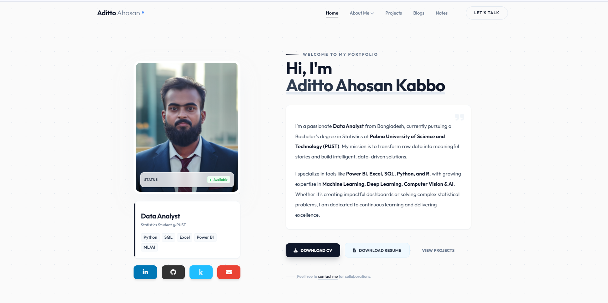

<h1 align="center" style="color:#0ea5e9; font-size:2.6rem; margin-bottom:0;">
  ✨ Aditto Ahosan Kabbo ✨
</h1>
<p align="center" style="font-size:1.2rem; color:#555; margin-top:0;">
  Data Analyst | Statistician | Machine Learning Enthusiast
</p>

<div align="center" style="margin-bottom: 1.5em;">

  <a href="https://adittoahosankabbo.github.io/" target="_blank" style="text-decoration:none;">
    
  </a>
  <a href="https://github.com/AdittoAhosanKabbo" target="_blank" style="text-decoration:none;">
    
  </a>
  <a href="https://linkedin.com/in/adittoahosankabbo" target="_blank" style="text-decoration:none;">
    
  </a>
  <a href="https://kaggle.com/adittoahosankabbo" target="_blank" style="text-decoration:none;">
    
  </a>
  <br>
</div>

---

<div align="center">
  <h3 style="color:#0ea5e9; margin-bottom:0.2em;"><strong>🌟 Portfolio Overview</strong></h3>
  <p>
    Welcome to my Portfolio. This website showcases my journey, projects, and skills in Data Science, Statistics, and AI. Built with a modern, responsive design philosophy featuring Tailwind CSS and interactive elements.
  </p>
</div>

<div align="center">
  <!-- 
    NOTE: These are placeholder paths for screenshots. 
    Please add 'webview.png' and 'mobileview.png' to your 'assets/images/' folder 
    to make these images appear correctly on GitHub. 
  -->
  
  
  <br>
  <em style="font-size:1.07em; color:#0ea5e9;">🌐 Desktop Experience</em>
</div>

---
<!-- Projects Section -->
<h2 align="center">📂 Featured Projects</h2>

<table align="center">
  <thead>
    <tr>
      <th width="30%">Project</th>
      <th width="15%">Tech Stack</th>
      <th width="40%">Description</th>
      <th width="15%">Links</th>
    </tr>
  </thead>
  <tbody>
    <tr>
      <td align="center">
        <b>FoodPanda Sales Analysis</b><br>
        
      </td>
      <td align="center">
        <br>
        
      </td>
      <td>
        A comprehensive Excel analytics solution analyzing sales data, customer behavior, and delivery KPIs. Features dynamic dashboards and in-depth reporting.
      </td>
      <td align="center">
        <a href="https://github.com/AdittoAhosanKabbo/FoodPanda_Sales_Analysis_Excel_Project">
          
        </a>
      </td>
    </tr>
    <tr>
      <td align="center">
        <b>Inventory Management</b><br>
        
      </td>
      <td align="center">
        <br>
        
      </td>
      <td>
        Interactive dashboard to optimize stock levels, track supplier performance, and enhance warehouse efficiency.
      </td>
      <td align="center">
        <a href="https://app.powerbi.com/view?r=eyJrIjoiMTc3MDA2N2UtYmU3Mi00ZjFiLWExNWEtMWE5NDI4NjYxNmJhIiwidCI6IjQ2NTRiNmYxLTBlNDctNDU3OS1hOGExLTAyZmU5ZDk0M2M3YiIsImMiOjl9">
          
        </a>
      </td>
    </tr>
    <tr>
      <td align="center">
        <b>Voice Separation (ICA)</b><br>
        
      </td>
      <td align="center">
        <br>
        
      </td>
      <td>
        Solving the "Cocktail Party Problem" using Independent Component Analysis (ICA) to isolate overlapping audio signals.
      </td>
      <td align="center">
        <a href="https://www.kaggle.com/code/adittoahosankabbo/ica-cocktail-party-problem">
          
        </a>
      </td>
    </tr>
    <tr>
      <td align="center">
        <b>HR Analytics</b><br>
        
      </td>
      <td align="center">
        
      </td>
      <td>
        Tracking key metrics including attrition rates, employee demographics, and performance trends to drive talent strategy.
      </td>
      <td align="center">
        <a href="https://github.com/AdittoAhosanKabbo/HR_Analytics_Power_Bi_Project">
          
        </a>
      </td>
    </tr>
  </tbody>
</table>

---


## 🌟 Key Features

<div style="display:grid; grid-template-columns:repeat(auto-fit, minmax(300px, 1fr)); gap:20px; margin:30px 0;">

### 🎯 Modern User Interface
- **Unified Design System**: Consistent professional header and footer across all pages (`index`, `about`, `projects`, etc.).
- **Clean & Minimalist**: Utilizing Tailwind CSS and grid layouts for a sleek, clutter-free top-tier aesthetic.
- **Responsive Layout**: Fully optimized for desktops, tablets, and mobile devices with hamburger menus and adaptive grids.
- **Interactive Elements**: Glassmorphism effects, hover interactions, and smooth transitions.

### 📊 Comprehensive Portfolio Ecosystem
- **Project Gallery**: Detailed case studies with video previews and live dashboards in `project.html`.
- **Professional Identity**: Dedicated `about.html` featuring a timeline of education, verified certifications, and detailed skills.
- **Content Hub**: Integrated `blogs.html` for deep-dive articles and `notes.html` for quick updates.
- **Direct Connection**: A polished `contact.html` for easy professional outreach.

### 🛠️ Technical Implementation
- **Tailwind CSS**: Rapid styling with utility classes and custom configuration (fonts, colors).
- **Vanilla JavaScript**: Lightweight interactions (modals, mobile menu, toggles) without framework overhead.
- **Premium Typography**: Using 'Outfit' and 'Inter' Google Fonts for a modern, readable feel.
- **FontAwesome**: High-quality icons for visual hierarchies and social links.

</div>

---

## 🛠️ Technology Stack

<div style="background:#f0f9ff; padding:20px; border-radius:12px; margin:30px 0;">

| Category        | Technologies                                                                 |
|-----------------|------------------------------------------------------------------------------|
| **Structure**   |  |
| **Styling**     |   |
| **Scripting**   |  |
| **Icons & Fonts**|   |

</div>

---

## 🏗️ Project Structure

```bash
2026 portfolio/
├── assets/
│   ├── images/          # Profile pictures, logos, and project visuals
│   │   ├── aakpro.png   # Main profile image
│   │   ├── FOODPANDA SALES/
│   │   └── ...
├── index.html           # Main Landing Page / Home
├── about.html           # Detailed About Me, Skills, Education & Certifications
├── project.html         # Featured Projects Gallery
├── blogs.html           # Articles & Insights
├── notes.html           # Quick Thoughts & Updates
├── contact.html         # Contact Form & connection details
├── styles.css           # Custom CSS overrides
├── script.js            # Interactive logic (Modals, Toggles)
└── README.md            # Documentation
```

---

## ⚡️ How to Run & Customize

<details open>
<summary><b>🚀 Quick Start</b></summary>

1. **Clone the repository**:
   ```bash
   git clone https://github.com/AdittoAhosanKabbo/adittoahosankabbo.github.io.git
   ```

2. **Open the project**:
   Simply open `index.html` in your browser. No complex build steps required as Tailwind is loaded via CDN for development flexibility.

3. **Customize**:
   - Edit `index.html` content to update your bio or links.
   - Modify the `tailwind.config` script in the `<head>` or `styles.css` for design tweaks.
   - Place new images in `assets/images/`.

</details>

<div align="center" style="color:#0ea5e9; font-size:1.18rem; margin-top:2.5em; margin-bottom:1em;">
  <hr style="border: none; border-top: 2px dashed #0ea5e9; width:60%; margin: 40px auto 24px;">
    <p>
    Built with ❤️ and ☕ by <a href="https://github.com/AdittoAhosanKabbo">Aditto Ahosan Kabbo</a>
  </p>
  <p style="font-size: 0.8rem; color: #94a3b8;">
    © 2026 All Rights Reserved.
  </p>
</div>
